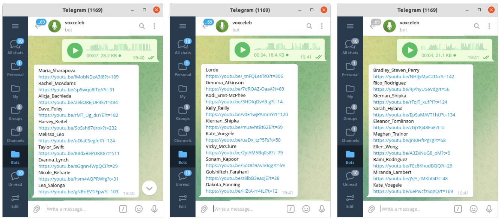

#### Search for Similar Voices

This tool allows you to record a short voice message and find the most similar voices (among celebrities) to yours. It's based on the embeddings extracted from short audio clips (celebrity interviews on youtube) using the "spkrec-ecapa-voxceleb" model from [speechbrain](https://github.com/speechbrain/speechbrain) toolkit. [[demo](https://t.me/vaaliferov_voxceleb_bot)]

```bash
python3 -m venv env
source env/bin/activate
pip install -r requirements.txt
gdown 1up5kZYuam340giqNp72-Cg2XwYiC2fTG -O vox.csv
gdown 1eL2OakHyvWL7mCdOu3UAxERIwL1lxJvy -O ecapa_vox.npy
python3 bot.py <bot_owner_id> <bot_token>
```


